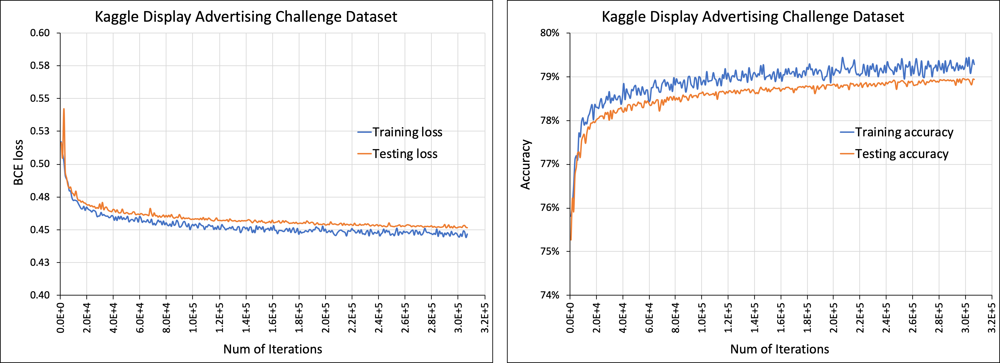

Deep Learning Recommendation Model for Personalization and Recommendation Systems:
=================================================================================
*Copyright (c) Facebook, Inc. and its affiliates.*

Description:
------------
An implementation of a deep learning recommendation model (DLRM)
The model input consists of dense and sparse features. The former is a vector
of floating point values. The latter is a list of sparse indices into
embedding tables, which consist of vectors of floating point values.
The selected vectors are passed to mlp networks denoted by triangles,
in some cases the vectors are interacted through operators (Ops).
```
output:
                    probability of a click
model:                        |
                             /\
                            /__\
                              |
      _____________________> Op  <___________________
    /                         |                      \
   /\                        /\                      /\
  /__\                      /__\           ...      /__\
   |                          |                       |
   |                         Op                      Op
   |                    ____/__\_____           ____/__\____
   |                   |_Emb_|____|__|    ...  |_Emb_|__|___|
input:
[ dense features ]     [sparse indices] , ..., [sparse indices]
```
 More precise definition of model layers:
 1) fully connected layers of an mlp

    z = f(y)

    y = Wx + b

 2) embedding lookup (for a list of sparse indices p=[p1,...,pk])

    z = Op(e1,...,ek)

    obtain vectors e1=E[:,p1], ..., ek=E[:,pk]

 3) Operator Op can be one of the following

    Sum(e1,...,ek) = e1 + ... + ek

    Dot(e1,...,ek) = [e1'e1, ..., e1'ek, ..., ek'e1, ..., ek'ek]

    Cat(e1,...,ek) = [e1', ..., ek']'

    where ' denotes transpose operation

Cite [Work](https://arxiv.org/abs/1906.00091):
```
@article{DLRM19,
  author    = {Maxim Naumov and Dheevatsa Mudigere and Hao{-}Jun Michael Shi and Jianyu Huang and Narayanan Sundaraman and Jongsoo Park and Xiaodong Wang and Udit Gupta and Carole{-}Jean Wu and Alisson G. Azzolini and Dmytro Dzhulgakov and Andrey Mallevich and Ilia Cherniavskii and Yinghai Lu and Raghuraman Krishnamoorthi and Ansha Yu and Volodymyr Kondratenko and Stephanie Pereira and Xianjie Chen and Wenlin Chen and Vijay Rao and Bill Jia and Liang Xiong and Misha Smelyanskiy},
  title     = {Deep Learning Recommendation Model for Personalization and Recommendation Systems},
  journal   = {CoRR},
  volume    = {abs/1906.00091},
  year      = {2019},
  url       = {https://arxiv.org/abs/1906.00091},
}
```

Related Work:

On the [system architecture implications](https://arxiv.org/abs/1906.03109), with DLRM as one of the benchmarks,
```
@article{ArchImpl19,
  author    = {Udit Gupta and Xiaodong Wang and Maxim Naumov and Carole{-}Jean Wu and Brandon Reagen and David Brooks and Bradford Cottel and Kim M. Hazelwood and Bill Jia and Hsien{-}Hsin S. Lee and Andrey Malevich and Dheevatsa Mudigere and Mikhail Smelyanskiy and Liang Xiong and Xuan Zhang},
  title     = {The Architectural Implications of Facebook's DNN-based Personalized Recommendation},
  journal   = {CoRR},
  volume    = {abs/1906.03109},
  year      = {2019},
  url       = {https://arxiv.org/abs/1906.03109},
}
```

On the [embedding compression techniques (for number of vectors)](https://arxiv.org/abs/1909.02107), with DLRM as one of the benchmarks,
```
@article{QuoRemTrick19,
  author    = {Hao{-}Jun Michael Shi and Dheevatsa Mudigere and Maxim Naumov and Jiyan Yang},
  title     = {Compositional Embeddings Using Complementary Partitions for Memory-Efficient Recommendation Systems},
  journal   = {CoRR},
  volume    = {abs/1909.02107},
  year      = {2019},
  url       = {https://arxiv.org/abs/1909.02107},
}
```

On the [embedding compression techniques (for dimension of vectors)](https://arxiv.org/abs/1909.11810), with DLRM as one of the benchmarks,
```
@article{MixDimTrick19,
  author    = {Antonio Ginart and Maxim Naumov and Dheevatsa Mudigere and Jiyan Yang and James Zou},
  title     = {Mixed Dimension Embeddings with Application to Memory-Efficient Recommendation Systems},
  journal   = {CoRR},
  volume    = {abs/1909.11810},
  year      = {2019},
  url       = {https://arxiv.org/abs/1909.11810},
}
```

Implementation
--------------
**DLRM PyTorch**. Implementation of DLRM in PyTorch framework:

       dlrm_s_pytorch.py

**DLRM Caffe2**. Implementation of DLRM in Caffe2 framework:

       dlrm_s_caffe2.py

**DLRM Data**. Implementation of DLRM data generation and loading:

       dlrm_data_pytorch.py, dlrm_data_caffe2.py, data_utils.py

**DLRM Tests**. Implementation of DLRM tests in ./test

       dlrm_s_test.sh

**DLRM Benchmarks**. Implementation of DLRM benchmarks in ./bench

       dlrm_s_criteo_kaggle.sh, dlrm_s_criteo_terabyte.sh, dlrm_s_benchmark.sh

Related Work:

On the [Glow framework](https://github.com/pytorch/glow) implementation
```
https://github.com/pytorch/glow/blob/master/tests/unittests/RecommendationSystemTest.cpp
```
On the [FlexFlow framework](https://github.com/flexflow/FlexFlow) distributed implementation with Legion backend
```
https://github.com/flexflow/FlexFlow/blob/master/examples/cpp/DLRM/dlrm.cc
```

How to run dlrm code?
--------------------
1) A sample run of the code, with a tiny model is shown below
```
$ python dlrm_s_pytorch.py --mini-batch-size=2 --data-size=6
time/loss/accuracy (if enabled):
Finished training it 1/3 of epoch 0, -1.00 ms/it, loss 0.451893, accuracy 0.000%
Finished training it 2/3 of epoch 0, -1.00 ms/it, loss 0.402002, accuracy 0.000%
Finished training it 3/3 of epoch 0, -1.00 ms/it, loss 0.275460, accuracy 0.000%
```
2) A sample run of the code, with a tiny model in debug mode
```
$ python dlrm_s_pytorch.py --mini-batch-size=2 --data-size=6 --debug-mode
model arch:
mlp top arch 3 layers, with input to output dimensions:
[8 4 2 1]
# of interactions
8
mlp bot arch 2 layers, with input to output dimensions:
[4 3 2]
# of features (sparse and dense)
4
dense feature size
4
sparse feature size
2
# of embeddings (= # of sparse features) 3, with dimensions 2x:
[4 3 2]
data (inputs and targets):
mini-batch: 0
[[0.69647 0.28614 0.22685 0.55131]
 [0.71947 0.42311 0.98076 0.68483]]
[[[1], [0, 1]], [[0], [1]], [[1], [0]]]
[[0.55679]
 [0.15896]]
mini-batch: 1
[[0.36179 0.22826 0.29371 0.63098]
 [0.0921  0.4337  0.43086 0.49369]]
[[[1], [0, 2, 3]], [[1], [1, 2]], [[1], [1]]]
[[0.15307]
 [0.69553]]
mini-batch: 2
[[0.60306 0.54507 0.34276 0.30412]
 [0.41702 0.6813  0.87546 0.51042]]
[[[2], [0, 1, 2]], [[1], [2]], [[1], [1]]]
[[0.31877]
 [0.69197]]
initial parameters (weights and bias):
[[ 0.05438 -0.11105]
 [ 0.42513  0.34167]
 [-0.1426  -0.45641]
 [-0.19523 -0.10181]]
[[ 0.23667  0.57199]
 [-0.16638  0.30316]
 [ 0.10759  0.22136]]
[[-0.49338 -0.14301]
 [-0.36649 -0.22139]]
[[0.51313 0.66662 0.10591 0.13089]
 [0.32198 0.66156 0.84651 0.55326]
 [0.85445 0.38484 0.31679 0.35426]]
[0.17108 0.82911 0.33867]
[[0.55237 0.57855 0.52153]
 [0.00269 0.98835 0.90534]]
[0.20764 0.29249]
[[0.52001 0.90191 0.98363 0.25754 0.56436 0.80697 0.39437 0.73107]
 [0.16107 0.6007  0.86586 0.98352 0.07937 0.42835 0.20454 0.45064]
 [0.54776 0.09333 0.29686 0.92758 0.569   0.45741 0.75353 0.74186]
 [0.04858 0.7087  0.83924 0.16594 0.781   0.28654 0.30647 0.66526]]
[0.11139 0.66487 0.88786 0.69631]
[[0.44033 0.43821 0.7651  0.56564]
 [0.0849  0.58267 0.81484 0.33707]]
[0.92758 0.75072]
[[0.57406 0.75164]]
[0.07915]
DLRM_Net(
  (emb_l): ModuleList(
    (0): EmbeddingBag(4, 2, mode=sum)
    (1): EmbeddingBag(3, 2, mode=sum)
    (2): EmbeddingBag(2, 2, mode=sum)
  )
  (bot_l): Sequential(
    (0): Linear(in_features=4, out_features=3, bias=True)
    (1): ReLU()
    (2): Linear(in_features=3, out_features=2, bias=True)
    (3): ReLU()
  )
  (top_l): Sequential(
    (0): Linear(in_features=8, out_features=4, bias=True)
    (1): ReLU()
    (2): Linear(in_features=4, out_features=2, bias=True)
    (3): ReLU()
    (4): Linear(in_features=2, out_features=1, bias=True)
    (5): Sigmoid()
  )
)
time/loss/accuracy (if enabled):
Finished training it 1/3 of epoch 0, -1.00 ms/it, loss 0.451893, accuracy 0.000%
Finished training it 2/3 of epoch 0, -1.00 ms/it, loss 0.402002, accuracy 0.000%
Finished training it 3/3 of epoch 0, -1.00 ms/it, loss 0.275460, accuracy 0.000%
updated parameters (weights and bias):
[[ 0.0543  -0.1112 ]
 [ 0.42513  0.34167]
 [-0.14283 -0.45679]
 [-0.19532 -0.10197]]
[[ 0.23667  0.57199]
 [-0.1666   0.30285]
 [ 0.10751  0.22124]]
[[-0.49338 -0.14301]
 [-0.36664 -0.22164]]
[[0.51313 0.66663 0.10591 0.1309 ]
 [0.32196 0.66154 0.84649 0.55324]
 [0.85444 0.38482 0.31677 0.35425]]
[0.17109 0.82907 0.33863]
[[0.55238 0.57857 0.52154]
 [0.00265 0.98825 0.90528]]
[0.20764 0.29244]
[[0.51996 0.90184 0.98368 0.25752 0.56436 0.807   0.39437 0.73107]
 [0.16096 0.60055 0.86596 0.98348 0.07938 0.42842 0.20453 0.45064]
 [0.5476  0.0931  0.29701 0.92752 0.56902 0.45752 0.75351 0.74187]
 [0.04849 0.70857 0.83933 0.1659  0.78101 0.2866  0.30646 0.66526]]
[0.11137 0.66482 0.88778 0.69627]
[[0.44029 0.43816 0.76502 0.56561]
 [0.08485 0.5826  0.81474 0.33702]]
[0.92754 0.75067]
[[0.57379 0.7514 ]]
[0.07908]
```

Testing
-------
Testing scripts to confirm functional correctness of the code
```
./test/dlrm_s_test.sh
Running commands ...
python dlrm_s_pytorch.py
python dlrm_s_caffe2.py
Checking results ...
diff test1 (no numeric values in the output = SUCCESS)
diff test2 (no numeric values in the output = SUCCESS)
diff test3 (no numeric values in the output = SUCCESS)
diff test4 (no numeric values in the output = SUCCESS)
```

*NOTE: Testing scripts accept extra arguments which will be passed along to the model, such as --use-gpu*

Benchmarking
------------
1) Performance benchmarking
    ```
    ./bench/dlrm_s_benchmark.sh
    ```

2) The code supports interface with the [Criteo Kaggle Display Advertising Challenge Dataset](https://ailab.criteo.com/ressources/).
   - Please do the following to prepare the dataset for use with DLRM code:
     - First, specify the raw data file (train.txt) as downloaded with --raw-data-file=<path/train.txt>
     - This is then pre-processed (categorize, concat across days...) to allow using with dlrm code
     - The processed data is stored as *.npz file in <root_dir>/input/*.npz
     - The processed file (*.npz) can be used for subsequent runs with --processed-data-file=<path/*.npz>
   - The model can be trained using the following script
     ```
     ./bench/dlrm_s_criteo_kaggle.sh [--test-freq=1024]
     ```



3) The code supports interface with the [Criteo Terabyte Dataset](https://labs.criteo.com/2013/12/download-terabyte-click-logs/).
   - Please do the following to prepare the dataset for use with DLRM code:
     - First, download the raw data files day_0.gz, ...,day_23.gz and unzip them
     - Specify the location of the unzipped text files day_0, ...,day_23, using --raw-data-file=<path/day> (the day number will be appended automatically)
     - These are then pre-processed (categorize, concat across days...) to allow using with dlrm code
     - The processed data is stored as *.npz file in <root_dir>/input/*.npz
     - The processed file (*.npz) can be used for subsequent runs with --processed-data-file=<path/*.npz>
   - The model can be trained using the following script
    ```
      ./bench/dlrm_s_criteo_terabyte.sh ["--test-freq=10240 --memory-map --data-sub-sample-rate=0.875"]
    ```
    - Corresponding pre-trained model is available under [CC-BY-NC license](https://creativecommons.org/licenses/by-nc/2.0/) and can be downloaded here
    [dlrm_emb64_subsample0.875_maxindrange10M_pretrained.pt](https://dlrm.s3-us-west-1.amazonaws.com/models/tb0875_10M.pt)


*NOTE: Benchmarking scripts accept extra arguments which will be passed along to the model, such as --num-batches=100 to limit the number of data samples*

4) The code supports interface with [MLPerf benchmark](https://mlperf.org).
   - Please refer to the following training parameters
   ```
     --mlperf-logging that keeps track of multiple metrics, including area under the curve (AUC)

     --mlperf-acc-threshold that allows early stopping based on accuracy metric

     --mlperf-auc-threshold that allows early stopping based on AUC metric

     --mlperf-bin-loader that enables preprocessing of data into a single binary file

     --mlperf-bin-shuffle that controls whether a random shuffle of mini-batches is performed
   ```
   - The MLPerf training model is completely specified and can be trained using the following script
   ```
     ./bench/run_and_time.sh [--use-gpu]
   ```
   - Corresponding pre-trained model is available under [CC-BY-NC license](https://creativecommons.org/licenses/by-nc/2.0/) and can be downloaded here
     [dlrm_emb128_subsample0.0_maxindrange40M_pretrained.pt](https://dlrm.s3-us-west-1.amazonaws.com/models/tb00_40M.pt)

5) The code now supports synchronous distributed training, we support gloo/nccl/mpi backend, we provide launching mode for [pytorch distributed launcher](https://pytorch.org/docs/stable/distributed.html#launch-utility) and Mpirun. For MPI, users need to write their own MPI launching scripts for configuring the running hosts. For example, using pytorch distributed launcher, we can have the following command as launching scripts:
```
# for single node 8 gpus and nccl as backend on randomly generated dataset:
python -m torch.distributed.launch --nproc_per_node=8 dlrm_s_pytorch.py --arch-embedding-size="80000-80000-80000-80000-80000-80000-80000-80000" --arch-sparse-feature-size=64 --arch-mlp-bot="128-128-128-128" --arch-mlp-top="512-512-512-256-1" --max-ind-range=40000000
--data-generation=random --loss-function=bce --round-targets=True --learning-rate=1.0 --mini-batch-size=2048 --print-freq=2 --print-time --test-freq=2 --test-mini-batch-size=2048 --memory-map --use-gpu --num-batches=100 --dist-backend=nccl

# for multiple nodes, user can add the related argument according to the launcher manual like:
--nnodes=2 --node_rank=0 --master_addr="192.168.1.1" --master_port=1234
```


Model checkpoint saving/loading
-------------------------------
During training, the model can be saved using --save-model=<path/model.pt>

The model is saved if there is an improvement in test accuracy (which is checked at --test-freq intervals).

A previously saved model can be loaded using --load-model=<path/model.pt>

Once loaded the model can be used to continue training, with the saved model being a checkpoint.
Alternatively, the saved model can be used to evaluate only on the test data-set by specifying --inference-only option.


Version
-------
0.1 : Initial release of the DLRM code

1.0 : DLRM with distributed training, cpu support for row-wise adagrad optimizer

Requirements
------------
pytorch-nightly (*11/10/20*)

scikit-learn

numpy

onnx (*optional*)

pydot (*optional*)

torchviz (*optional*)

mpi (*optional for distributed backend*)


License
-------
This source code is licensed under the MIT license found in the
LICENSE file in the root directory of this source tree.
